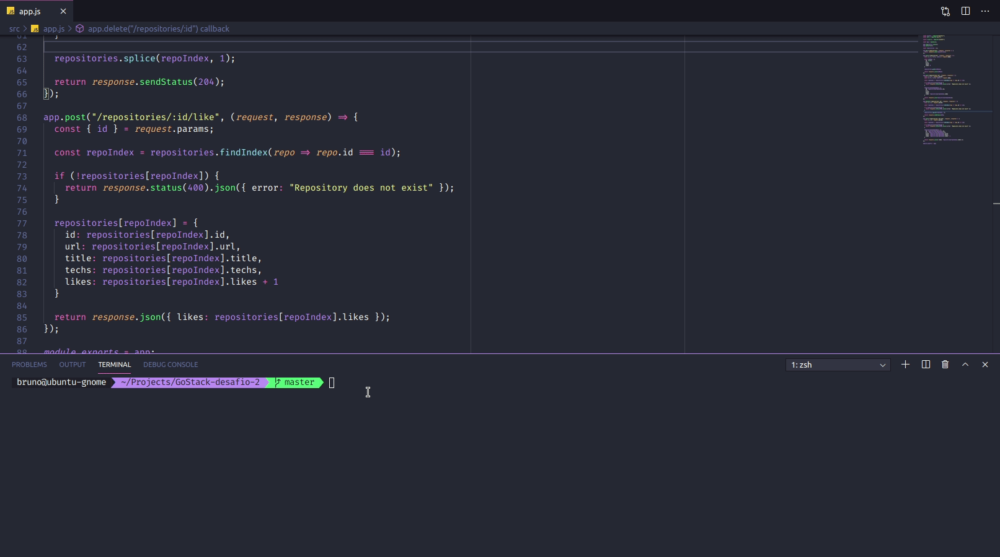
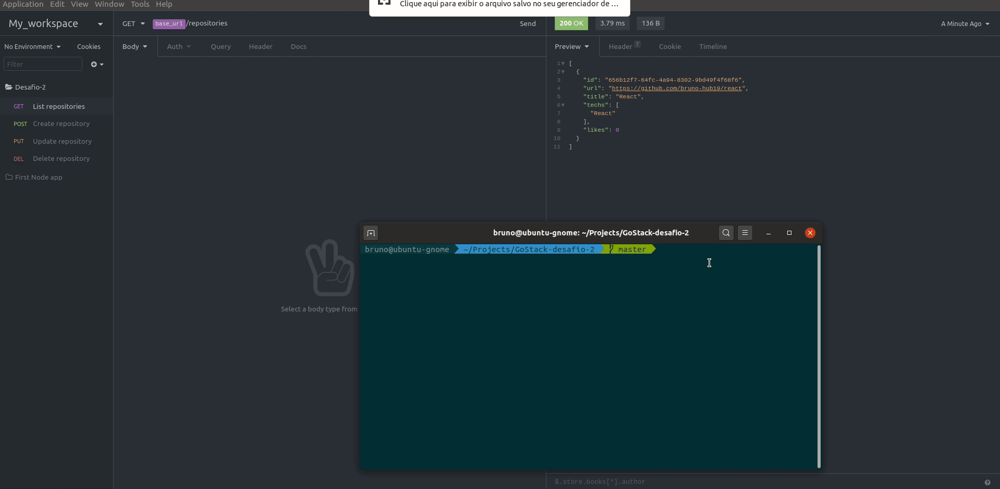

# :bulb: Sobre o projeto

O projeto trata-se de uma API para efetuar as operações de CRUD **(Create, Read, Update and Delete)** para repositórios. Além disso, conta com a funcionalidade para dar likes em determinado repositório.

A ideia principal parece simples, e na verdade é, mas com testes automatizados e guiando-se por estes durante o desenvolvimento, ou seja, TDD **(Test Driven Development)**.

## :paperclip: Pequena demonstração sobre o que foi desenvolvido

#### Resultado dos testes automatizados. No total de 9 testes, os 9 obtiveram êxito.

#### Testes manuais realizados utilizando o cliente Insomnia

## :pencil2: Considerações finais sobre o projeto

A ideia de testes automatizados me assustou no começo, pois se trata de uma aplicação muito simples, mas ao final do desafio senti uma satisfação imensa em tê-los presente e conseguir visualizar tudo funcionando perfeitamente. **A partir de agora, não me imagino construindo uma aplicação sem a presença de testes!** :satisfied:

## :pushpin: Para contribuir ou clonar o projeto

- Para contribuir abra uma `issue`, dê um `fork` no projeto, faça suas alterações e abra uma `pull request` :satisfied:

- Para clonar `git clone https://github.com/Bruno-hub19/GoStack-desafio-2.git`

#### #boracodar :purple_heart:
